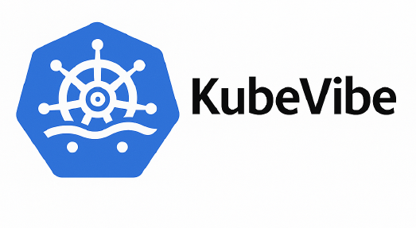

# KubeVibe: A Finite-State–Machine Pipeline for LLM-Driven Cloud-Native Service Prototyping

Rapid prototyping of Kubernetes-based services with intent extraction and a finite-state deployment pipeline.




## Overview

KubeVibe is an experimental framework for LLM-driven rapid prototyping of Kubernetes services, developed within the context of cloud orchestration research.
The system receives an open-ended natural-language prompt describing a desired service (e.g., “Develop a credit-card validation microservice”), and autonomously executes a fully instrumented pipeline:

1. Intent extraction & curation
2. Artifact generation (Python service, Dockerfile, Kubernetes manifests)
3. Container build
4. Manifest validation
5. Deployment to Kubernetes
6. Connectivity testing
7. Helm chart generation
8. Automatic fixing loop when failures occur

The entire process is orchestrated as a finite state machine (FSM) where each stage is explicitly defined, logged, and recoverable through LLM-powered error-fixing.

This repository contains the complete reference implementation of the pipeline for experimentation, reproducibility, and further research.

## Repository Structure

The repository consists of modular components, each implementing one stage of the pipeline.

### Top-Level Files

| File                      | Purpose                                                                 |
|---------------------------|-------------------------------------------------------------------------|
| `kubevibeZ.py`            | Main orchestrator implementing the FSM and full execution loop.         |
| `fsmStages.py`            | Declarative definitions of stages and transitions for the FSM.          |
| `parameters.py`           | Context presets for LLM prompting.                                      |
| `prompts.py`              | Templates and structured prompting utilities.                           |
| `schemas.py`, `schemas2.py` | JSON schemas used to request structured outputs from LLMs.           |
| `log.py`                  | Unified logging utilities for phases, control messages, and raw LLM interactions. |
| `README.md`               | Repository documentation (this file).                                   |

### Pipeline Architecture

KubeVibe executes a deterministic 
pipeline, with automatic fallback to a Fix stage upon failure.

 Generate → Build → Validate → Deploy → Connect → Chart → Success 
 
## Module Documentation

### 1. Intent Handling (`intent.py`)
- Extracts the user intent from the natural-language prompt.
- Supports:
  - raw prompting (“none”)
  - curated prompting with structured schemas
  - curated zero-shot / few-shot prompting
  - few-shot injection from a bank of reference deployments
- Produces:
  - `curatedintent`
  - success flag
  - full logs of the curation process

This stage unifies incoming prompts into a format suitable for artifact generation.

---

### 2. Artifact Generation (`generate.py`)
- Sends the curated intent to an LLM endpoint (`localhost:11434` by default).
- Requests output conforming to `artifacts_schema()`:
  - `pythonfilecontent`
  - `containerfilecontent`
  - `yamlfilecontent`
  - optional `requirements`
- Writes all raw LLM interactions into `kubevibe.rawlog`.

Extraction and JSON parsing are handled by `extractanswer()`.

---

### 3. Build Stage (`build.py`)

**Responsibilities:**

- Materializes generated artifacts into the working directory:
  - Writes `myapp.py`
  - Writes `Dockerfile`
  - Writes `requirements.txt`
- Builds the image:
  - `docker build`
  - `docker tag`
  - `docker push`
- Serializes Kubernetes manifests via `smartyamldump()`.

Build logs are captured and stored for later error-fixing.

---

### 4. Validation (`validate.py`)

- Performs a dry-run validation for the artifacts.
- Returns a success/failure flag.
- Determines next FSM transition.

---
### 5. Deployment (`deploy.py`)

- Creates a disposable namespace (`vibe-test-deploy`).
- Applies the manifest.
- Tears down the namespace after validation.
- All `kubectl` output is logged.

This stage verifies whether the generated Deployment and Service can be created.

---

### 6. Connectivity Testing (`connect.py`)

- Deploys into a temporary namespace (`vibe-test-service`).
- Extracts the service ClusterIP.
- Attempts multiple `curl` probes (ports 80, 443, 5000).
- Identifies if the service is reachable.
- Deletes the namespace afterwards.
- Returns the discovered endpoint if successful.

This stage tests whether the service actually *responds*.

---

### 7. Helm Chart Generation (`chart.py`)

- Builds a Helm chart folder structure (`genchart/`).
- Injects generated manifests.
- Runs:
  - `helm lint`
  - `helm package`
- Produces a distributable `.tgz`.

---
### 8. Automated Fixing Loop (`fix.py`)

If any stage fails:

- Collects artifacts, logs, and stage metadata.
- Sends an LLM request asking for **minimal corrective edits only**.
- Diffs and applies fixes to:
  - `myapp.py`
  - `Dockerfile`
  - `vibe.yaml`
  - `requirements.txt`
- Re-inserts the fixed artifacts into the FSM.
- Loops back depending on the `fixfromzero` configuration.

This makes the pipeline *self-healing* and suitable for experimentation with model reliability.

---

### Main Orchestrator (`kubevibeZ.py`)

This is the central entry point that:

- Parses environment variables (`MODEL`, `TIMEOUT`, `N`, etc.).
- Prepares timestamped run directories under `myto/<model>/<timestamp>/`.
- Requests intent extraction.
- Executes the FSM step-by-step.
- Logs every transition, success, and failure.
- Optionally renders a DOT/Graphviz execution graph through `build_dot_math()`.

---

### Running the tool

You must have:

- Docker installed and logged in to push images
- `kubectl` configured to access a working Kubernetes cluster
- Helm installed
- An LLM endpoint running locally (e.g., Ollama)

Then:

```bash
python3 kubevibeZ.py "Develop a credit card validation service"
```

### Optional environment variables

```bash
export MODEL="deepseek-r1:32b"
export INTENT_METHOD="json-with-required"
export IVAL_METHOD="llm-as-a-judge"
export FIXFZERO=0
export TIMEOUT=1200
export N=20
```

### Output structure

KubeVibe will create a directory:

`myto/<model>/<timestamp>_output/`

containing:
- Generated artifacts
- Raw logs
- Helm chart
- DOT/SVG FSM graph (when enabled)

## Research Use

KubeVibe is designed for:

- Evaluating LLM reliability in multi-stage cloud-native tasks
- Studying intent representation strategies
- Benchmarking structured prompting vs. conversational patterns
- Measuring depth, success rates, and fix loop stability
- Generating reproducible traces for EU-funded research deliverables

All experiments referenced in the secondment technical report map directly to these modules.

---

## Usage Notes

- KubeVibe deploys into **temporary namespaces** to avoid cluster pollution.
- No assumptions are made about the cluster beyond:
  - Kubernetes ≥ 1.30  
  - Working Docker registry for pushes
- Model endpoints must support the simple `/api/generate` interface used by Ollama-style servers.

---

## Future Extensions

Planned or in-progress work:

- Formal SLO/KPI-based intent representations
